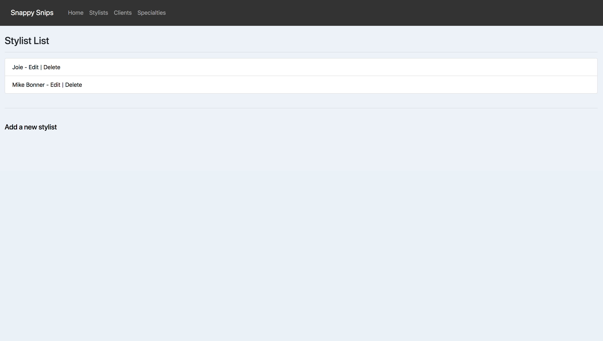
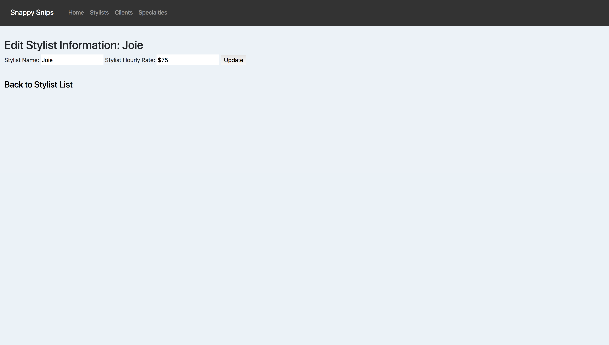
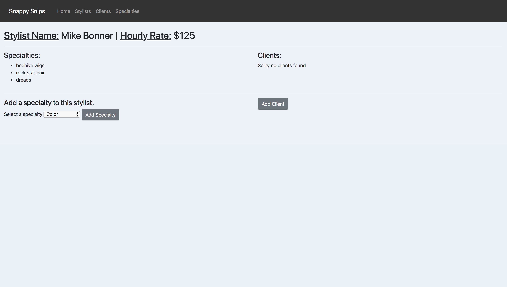
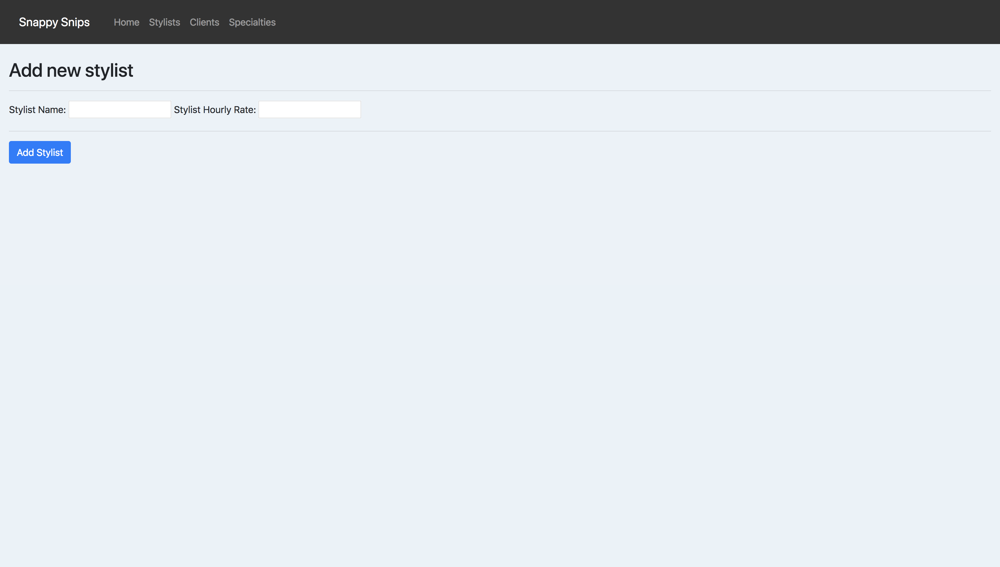
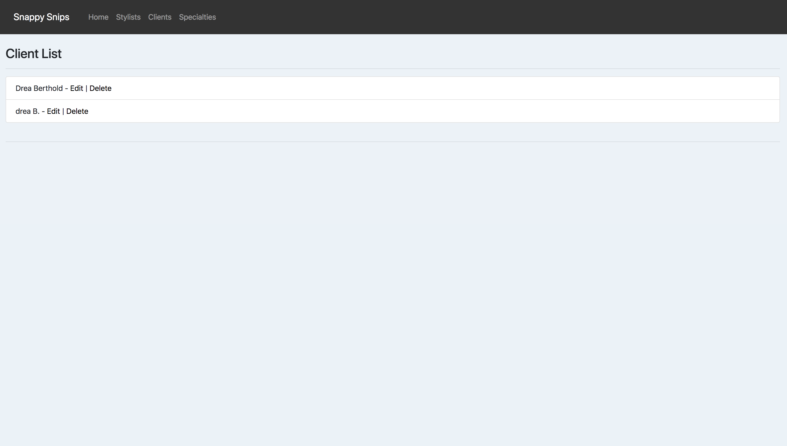
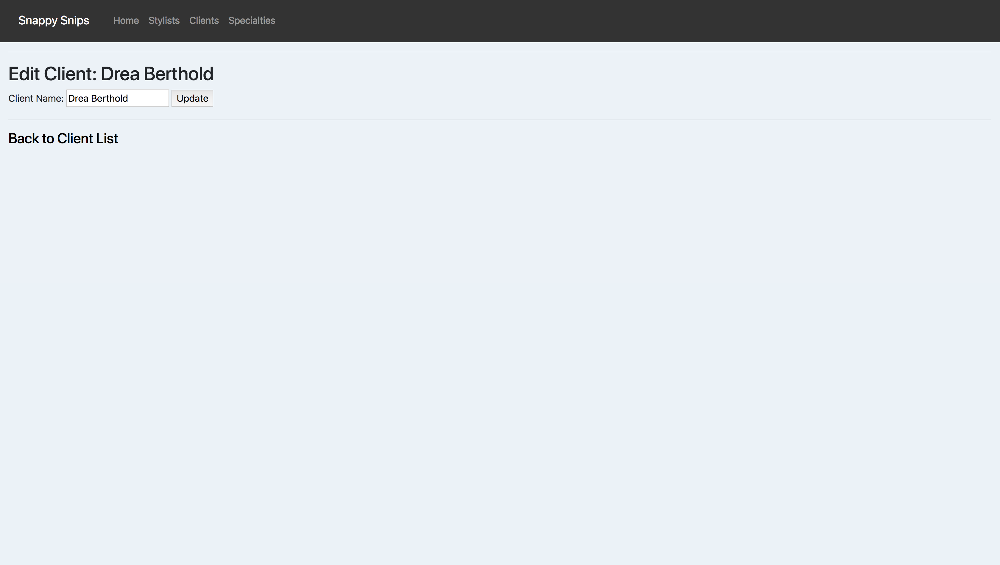
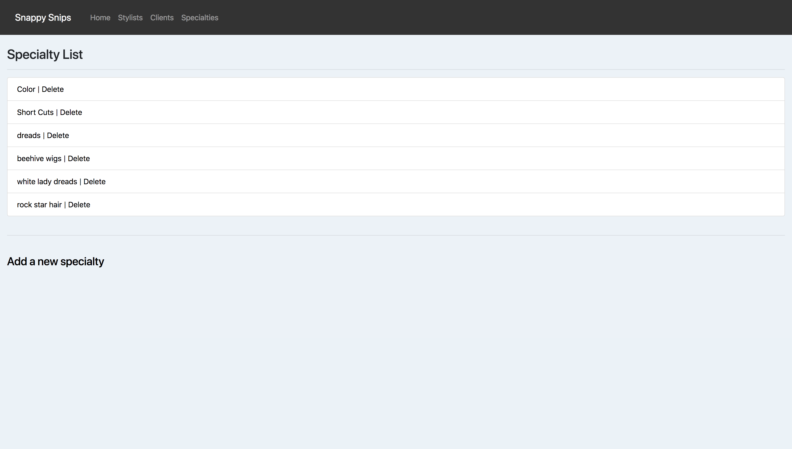
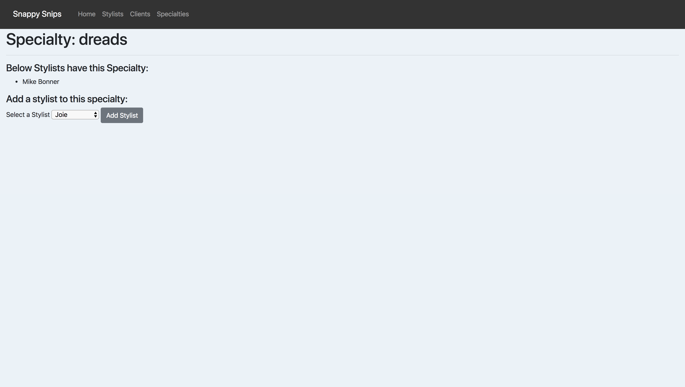

# Hair Salon

#### C# Epicodus week 4 project, 02/23/2018

#### By **Nanette Girzi**

## Description

This application will allow employees of a hair salon see a list of stylists, clients and specialties the salon has to offer. Also the employee will be able to add, update or delete stylists, clients and specialities.

_ The home page of the application.

_ Stylist List Page

_ Edit Stylist Page

_ Stylist Info Page

_ Add Stylist Page

_ Client List Page

_ Edit Client Page

_ Specialty Page

_ Add Specialty

##MySQL Commands

- CREATE DATABASE nanette_girzi;
- USE nanette_girzi;
- CREATE TABLE stylists (id serial PRIMARY KEY, stylist_name VARCHAR(255), stylist_rate VARCHAR(255));
- CREATE TABLE clients (id serial PRIMARY KEY, name VARCHAR(255), stylist_id INT);
- CREATE TABLE specialties (id serial PRIMARY KEY, specialty VARCHAR(255), stylist_id INT);
- CREATE TABLE specialty_stylists (id serial PRIMARY KEY, specialty_id INT, stylist_id INT);

## Setup/Installation Requirements

* Clone this repository to your desktop
* Navigate to project folder on desktop
* In terminal, inside project folder, type command "dotnet restore" "dotnet build", then "dotnet run"
* Open browser and go to http://localhost:5000

## Specifications

#### Allow user to enter a new stylist
#### Allow user to enter new client associated with stylists
#### Allow user to add specialties associated with stylists
#### Allow user to delete individual stylists
#### Allow user to edit Stylist details
#### Allow user to view stylist details
#### Allow user to Delete individual clients
#### Allow user to Edit individual clients
#### Allow  user to add specialties
#### Allow user to delete specialties
#### Allow user to add stylists to specialties

## Known Bugs

No known bugs at this time.

## Support and contact details

If you have suggestions please email ngirzi@gmail.com

## Technologies Used

* C#
* MySQL
* HTML
* Bootstrap
* MVC  
* Razor

### License

*This software is licensed under the MIT license.*

Copyright (c) 2018 **Nanette Girzi**
